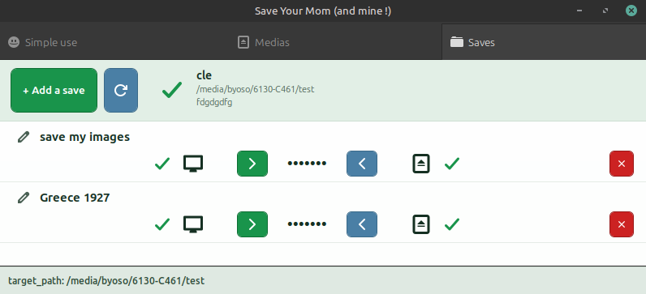

# Save Your Mom !

Your Mom (like mine) is struggling to make her backups ? Ok, let's simplify this with an application.

# important tip

If you want to preserve the file properties and file names exactly as they are on your computer, use a media formated in the same format as the disque you want to save from.

E.g:
your disque is EXT4 (most linux) -> save on an EXT4 external drive ('media' in the app)

It can work otherwise, but could be disapointing if you want to save some executable files and keep that property after restore.

# how it works

Run the app, you know what to do, it is simple... Just play a bit with it before trying this on your mom's PC to understand the basics.

# Behind the hood (Do not read, it is boring nerdy stuff !)

"Save Your Mom" uses 2 very tiny databases, one is local, and one is created on each media registered in a file named ".save_your_mom.json" (so yes, 1 local DB + 1 in each Media registered)

The local DB contains the Medias registered, the one on the Media contains the paths of the saves.

## Ok but why the hell 2 databases ?

Well, my mom's old PC will probably give its last breath soon... So, with the database stored in the media, instead of recreating each parametered save manually, I'll just add the already existing media in the app, and magically, all the path for the saves are back (except for the local ones, you'll probably have to re-bind them: click on the 'computer' icon, select a folder, done).

Don't thank me, your mom will.

# Changelog
- 1.1.1: On remove with geninstaller, the database ca be kept + robustess improvements.
- 1.1.0: Multi profiles supported.
- 1.0.0: That works fine !